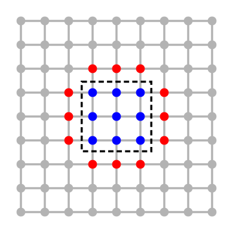
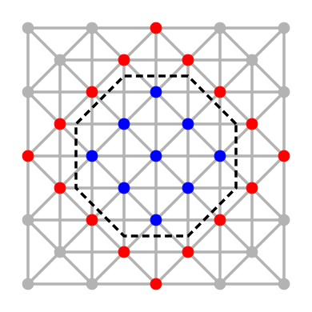
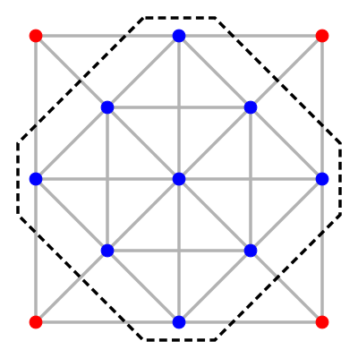
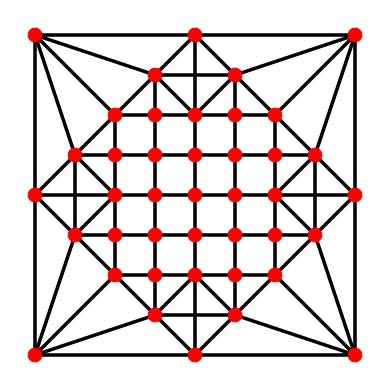

# Composite Graph Construction

Constructing composite graphs from parallel partitions can be important in reducing the computing time of algebraic solvers, as composite graphs can be used as preconditioners with low extra storage. Here we provide a sample code that demonstrates how to build a composite graph using the approaches described in [1] and [2].

A composite graph is a graph constructed from different levels of coarsening using an AMG hierarchy. Visually the process looks like:

   

*From left to right:* 

- Fine grid with home nodes denote in blue and expanded nodes in red
- Intersection of colored nodes in the fine grid with the first coarse grid resulting in the blue home nodes and their corresponding red expansion expansion
- Repeaded intersection for the coarsest grid and final expansion
- Composite graph constructed for all the grid

# Installation

To run this code we need `numpy`, `scipy`, `matplotlib`, `pyamg`, and `networkx`. All the packages can be installed using `pip`. Similarly, a `Dockerfile` is provided to build an image that contains all the necessary libraries.

# References

[1] &nbsp; R. Bank, R. Falgout, T. Jones, T. A. Manteuffel, S. F. McCormick, and J. W. Ruge, “Algebraic Multigrid Domain and Range Decomposition (AMG-DD/AMG-RD),” *SIAM Journal on Scientific Computing*, vol. 37, no. 5, pp. S113–S136, 2015

[2] &nbsp; P. D. Bello-Maldonado, "Polynomial Reduction with Full Domain Decomposition Preconditioner for Spectral Element Poisson Solvers," PhD thesis, University of Illinois at Urbana-Champaign, Urbana, IL, 2022
